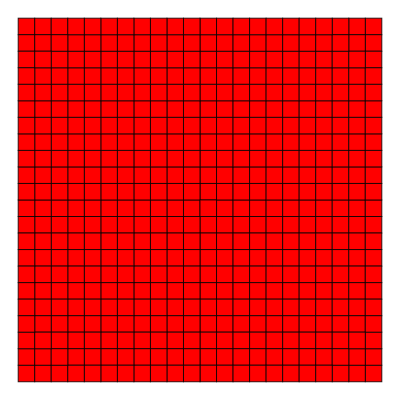
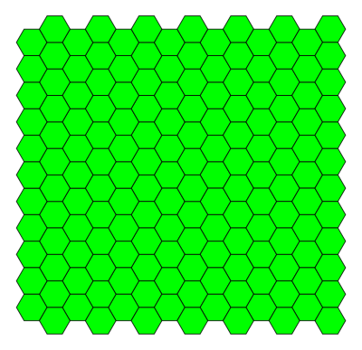
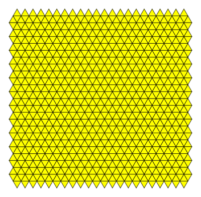
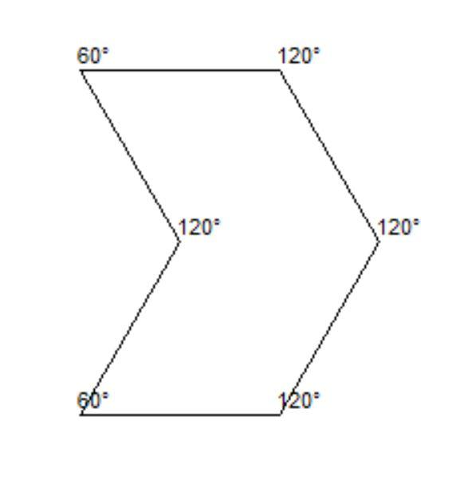
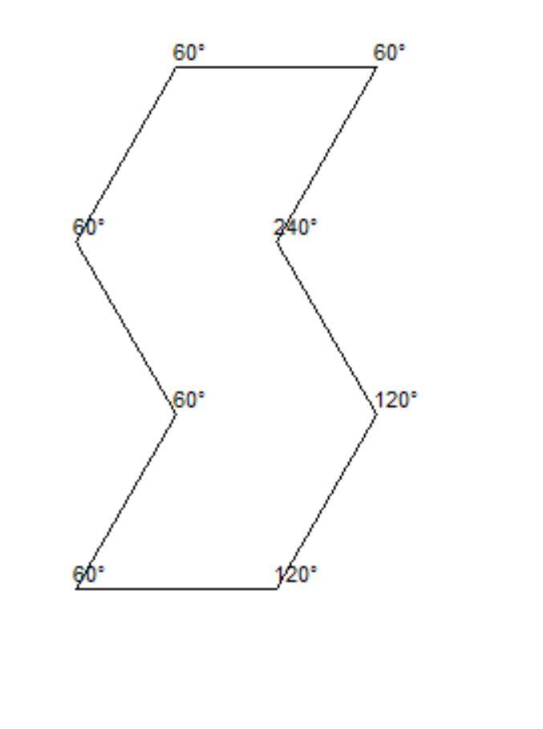
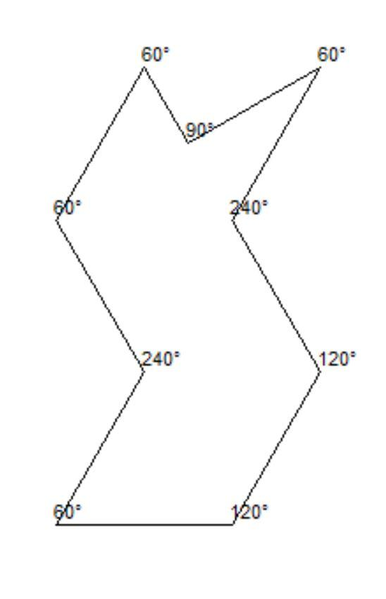
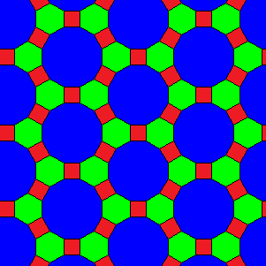
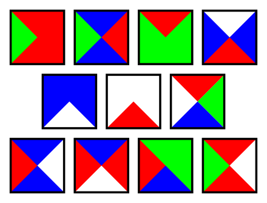
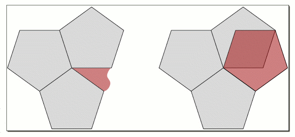
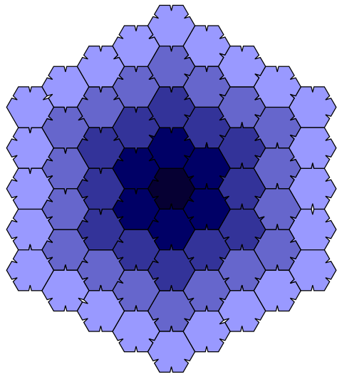

Adventures in Recreational Mathematics: Volume I.

Salutations!

This is the first of a new series in *The Librarian *– each issue, we will discuss a different mathematical field or distinct problem chosen due to their great utility, their results being intriguing or, quite simply, they are enjoyable to play around with.

Each article will be written by one of (or both of) *Isky Mathews & Benedict Randall Shaw*, discussing subjects we believe that others will find stimulating as we do on a daily basis.

Also, for those interested, at the end of each article we will leave a thematic problem of variable difficulty whose solutions should be emailed to either one of the authors. Mathematics can be confusing, it can be surprising but it can also be a lot of fun; this is what *Adventures in Recreational Mathematics *aims to tap into!

For our first issue, we will be considering *tiling. *Tiling is the study of how sets of polygons fit together on *the plane, *to see whether they *tile *(i.e. can be placed together in such a way that there are no gaps left across the plane) and to learn if there are geometric principles which could allow us to determine whether these sets can tile the plane or not. Formally, we are concerned with covers of the Euclidean plane formed by countable sets of *closed sets *such that they intersect only on their boundaries. We begin with the simplest form of tiling, *regular *tessellations, where the tiling is *translationally similar *over arbitrary distances and uses only identical *regular polygons – monohedral *examples of this (ones using only a single *prototile*) are very well known.

 

 

 

We would also say that these tilings are *isogonal *or *vertex-transitive, *i.e. every vertex has an identical arrangement of tiles around it, and also that they are *edge-to-edge *tilings, since a given edge of each tile touches no more than one edge from another tile.

Perhaps unsurprisingly, it is trivial to prove that for $∀ n∈R, n<2$ there is an irregular $n$-gon which tessellates. This can be seen by constructing the shapes below:

The leftmost figure displays a tessellating hexagon and by adding another pair of sides on top, we get the second figure (a tessellating octagon). We can continue adding pairs like this to get tessellating -gons for even. The third figure shows a way of making these figures odd sided, while retaining tessellation (the forked parts can interlock with two forked parts of other tiles). Thus, you can construct all even and odd numbered -gons for  using this method!

There are, as you can imagine, many other ways of constructing tessellating -gons and in fact many ways of tiling them. If we allow ourselves to tile on a plane with *negative curvature *(commonly known as the *hyperbolic plane*), then you can have significantly more tilings – for example, in the Euclidean plane we tile 6 equilateral triangles around a point but in the hyperbolic plane you can have  all the way to an infinite number of triangles around a point! This geometry requires greater examination on its own, but that is not the focus of the article.

There are also *semiregular tilings*, those that are made up of more than one tile but are still periodic, such as this lovely tiling using squares, hexagons and dodecagons:

However, these are all quite trivial examples and concepts. There are numerous, seriously difficult problems: the so-called *tiling problem, *the *five-fold symmetry problem *and understanding *Heesch’s Problem *are just a few.

The *tiling problem* is to create an algorithm or set of principles to determine whether a *prototile set* tiles, in finite time. A form of this was first proposed by the philosopher and mathematician Hao Wang in 1961, after discovering sets of *aperiodic* tiles called *Wang tiles. *An *aperiodic tiling *is one that has no arbitrary distance *translational symmetry *and *aperiodic tiles *are those that can *only *tile the plane aperiodically. The colours on each side of a Wang tile are a visual way of representing rules for placing them next to each other – here only same-coloured edges can touch but the same rules could just as easily be shown as indents and projections on the edges of each tile. Due to these "matching rules", these tiles have become colloquially known as *Wang dominoes *and the problem of determining whether a set of Wang tiles can tile the plane is often called the *Domino Problem.*

In 1966, Wang’s student *Berger *showed that there is no *general *algorithm for the Domino Problem. More formally, he showed that the problem is *undecidable* by showing that it is computationally *isomorphic *to the *halting problem *(the first problem ever shown to be undecidable, by Turing). However, there could be tiling-problem algorithms for subsets of the *set of all tile sets *(for example, the* Conway criterion*) and some still search for them today.

Heesch’s Problem and *Heesch numbers *were devised to help with the creation of such an algorithm for single tiles and to give a quantitative indication of the extent to which a tile does or doesn’t tessellate. The Heesch number of a tile is the maximum number of layers of clones that can completely surround the previous layer’s perimeter and the eponymous problem is to determine precisely the set of numbers that *can be Heesch numbers. *To illustrate what this means, consider a regular pentagon’s Heesch number: 1.

This is because the 2nd layer would have to touch the sides inside the cracks between the pentagons of the first layer (commonly referred to as the first *corona*), which is clearly impossible. Also, the tessellating regular polygons first mentioned in this article trivially have a Heesch number of .

Can we have a tile of finite Heesch number? It appears so: in 1995, Robert Ammann found a tile of Heesch number 3 and also constructed a tile, using indentations and projections on sides of hexagons, of Heesch number 4 and subsequently Casey Mann found an infinite family of tiles of Heesch number *5*, which is the highest finite number known to date.

 

You can see in the image that in the outermost layer there are four cases where indents in the hexagons "touch" each other – these parts of the perimeter cannot be covered in the next layer, giving the adjusted hexagon a Heesch number of 4.

The idea of the Heesch problem is to see whether there is a maximum Heesch number . If this was true then you could construct a finite tiling-problem algorithm: simply attempt to surround it by itself  times and if you can clearly continue then its Heesch number must be infinite, thus proving that it tessellates. This algorithm wouldn’t be particularly efficient (at minimum, it would be an EXPTIME, potentially even EXPTIME-complete, algorithm for those who are of the *computational complexity* persuasion) but it would represent a great step forward.

This demonstrates one of the remarkable facts about tiling as a subject to study: it is so simple to explain & to think about and yet its problems are apparently so difficult. Beyond using rational thought, having a good understanding of geometry and perhaps studying others’ work, there are no generally accepted tools or techniques used to solve tiling problems. The majority of those who have moved the subject forward have been individuals looking into the topic as a hobby.

If you’ve found this article interesting (or you just enjoy gazing at beautiful tilings), we suggest these topics for further reading:

* Roger Penrose’s contribution to aperiodic tilings

* Wikipedia’s wonderful catalog of *Euclidean tilings by convex regular polygons*

* Golden Triangles

* *The trouble with five *by Cambridge’s *Plus Magazine.*

* Voronoi tesselations

## Challenge I.:

**a)  **The *five-fold symmetry problem *is to find a tile set that consists of polygons with exactly five-fold symmetry or to show that such a set cannot exist. Your goal is much simpler, though themed on that basis: **Find one or more irregular pentagons that tile.**

**b)  Find a prototile/shape of Heesch number 3. **This is much harder, and we don’t have the answer to this, so for the purposes of Westminster, this is an open problem!

This article was written by *Isky Mathews* but feel free to send your solutions to either columnist!

