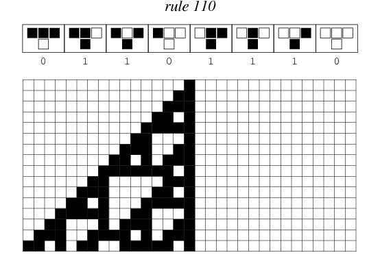
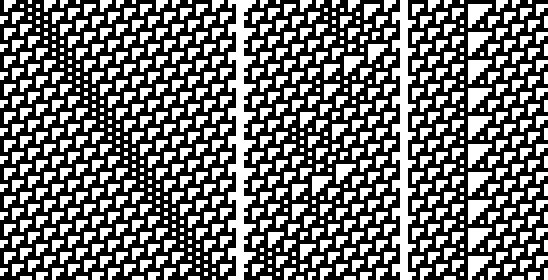
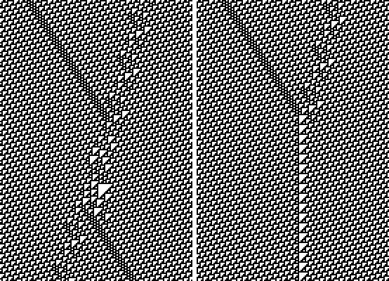
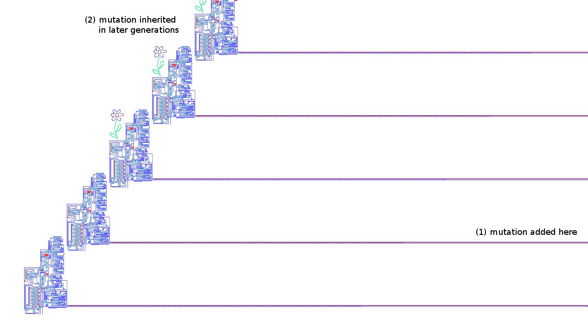

**Adventures in Recreational Mathematics: Volume II**

Salutations!

Welcome to the second instalment of AiRM, this time taking a look at **cellular automata**. 

We have some exciting articles lined up for the future, potentially including but not limited to Chaos Theory, Trans-finite Set Theory, Game Theory and more - so, watch this space!

To understand what a cellular automaton is, I think it is helpful to understand the motivation behind the concept’s creation in the 1940s, leading up to a book which essentially founded the field: *The Theory of Self-Reproducing Automata* by **John von Neumann**.

In this case, it is also necessary to have a word on John von Neumann, since he was an exceptional man and potentially merits the term genius in all the ways he contributed to mathematics. In fact, his remarkable intelligence was noticeable from a young age, when at just 6 years old, he was able to proficiently converse in Ancient Greek and became quickly famous in his school for being able to multiply and divide 8-digit numbers in his head in under 10 seconds. 


By 15, he was under the tutelage of Gabor Szego (a mathematician famous for his contributions to calculus and linear algebra), had a great understanding of most founding fields of higher mathematics and at age 19, he published his first mathematical papers. *Hans Bethe*, Nobel Prize winning physicist, was a long-time friend of von Neumann’s. When Bethe observed von Neumann talking with his baby daughter Marina, he noticed that "John" could very easily lower himself so that they were able to talk as equals and then wondered if von Neumann used just the same approach when talking to his physicist friends.

By the 1940s, von Neumann had become interested in self-replication. He wanted to comprehend on an abstract level how a dynamic system or mechanistic object like life on earth could go about creating copies of itself in an efficient way and one that could allow for variation (a property referred to as *evolvability*) – he came to the conclusion that it ultimately relied upon:

* The propagation of information in systems.

* The culmination of well-defined local rules into complex global behaviour.

* The information structure (or "tape" as he called it) being an active part of the construction process.

Consider that these observations were made prior to the discovery of the structure of DNA. von Neumann had, in a heuristic sense, understood what it had to look like.

To define a cellular automaton, consider an $n$-dimensional space (a plane, say) divided into discrete unit-squares, where each square is a *cell* which can be in one of a defined number of states. Then, we wish to propagate each cell to a new state with the use of a *ruleset*, where we look at a *neighbourhood* of defined nearby or local cells for a given cell and based on their states, we assign that cell its next state. The ruleset itself is an ordered list of sets-of-length 2 containing every possible configuration of the neighbourhood and a state assigned to that.

This sounds quite abstract, so to illustrate, we can take a look at one of the elementary automata, discovered in the 1980s by Stephen Wolfram.


 
This particular automaton is 1 dimensional, has 2 states and is named **_Rule 110_**, as you can see. Since Rule 110’s neighbourhood for a given cell consists of the cell itself \& the two cells directly adjacent to it (thus, having size 3) and since there are 2 states, the number of possible configurations of the neighbourhood is $2^3$, represented by the 8 boxes at the top just below the name. The row of three in a given box denotes a particular neighbourhood configuration (for example, the far right box is where the neighbourhood cells are only in State 0) and the cell in the middle column below it shows the defined outcome for that situation, which can be notated as a number in general from $1,2,…,n$ where the number of states is $n∈\mathbb{N},n>0$.


 You should notice that the boxes are arranged in a systematic order, gradually moving cell by cell down to the situation where all cells are in State 0. Thus, by numbering each situation with its state number like in the image, we can think of each situation as a digit in a base-$n$ number unique to that ruleset. For this automaton, this number is "01101110" which in base-10 is *110* – these numbers are called **_Wolfram numbers_** after the aforementioned Wolfram began to catalogue thousands of cellular automata to understand them experimentally using this notation.


The image below the boxes starts with a one dimensional *lattice* and a single State 1 cell and every row below it shows an iteration of the system by using the ruleset shown above.
In fact, Rule 110 holds particular meaning as a cellular automaton, since it was proven to be computational universal, i.e. it transfers information between cells in such a way that in rather specific situations, found by the mathematician Matthew Cook, one can encode numbers in binary form into it and perform computations or run programs on these numbers. While the proof itself and perhaps even the proper statement of the theorem is quite complicated and beyond the scope of *AiRM*, we can show you illustrations of information transfer within Rule 110. For example, there are numerous kinds of spaceships, configurations of cells that move as a single unit:
 


And here they collide:
 


Unfortunately, the proof mentioned was withheld for around a decade since Wolfram wanted it to be first mentioned in his nascent tome, *A New Kind of Science*, forcing Cook to not publish one of his most proud achievements as an employee of *Wolfram Research*. Eventually, when Cook published early, Wolfram attempted to sue him for breaking a non-disclosure agreement… We at AiRM believe it is always bad when the spread of intellectual work is inhibited and this should never happen again.

However, we must return to John von Neumann and his design for a self-replicating machine: while Rule 110 is only 1 dimensional with 2 states, von Neumann’s original automaton had a grand 29 states, was 2 dimensional & used a neighbourhood which looked at a cell and its four adjacent cells. As you can imagine, the ruleset would be massive and is too long to explain here (it required its own book, you see) but we can give an outline. There was the null or ground State 0 as per usual, a group of 8 *transmission* states which could act as wires to transmit binary signals,  a group of 4 *confluent* states which could act as junctions for these wires to give information to & finally 16 *transition* states which could be built by confluent cells given the right signals from transmission cells.


The result was an incredible piece of engineering (one which many have tried fairly unsuccessfully to make simpler): a *universal constructor*, which, if added to any arrangement of cells in von Neumann’s automaton, would be able to reproduce that arrangement countless numbers of times. The image below, which I have yet to fully understand, is taken from WikiCommons based on the work of a mathematician who actually implemented von Neumann’s machine. Considering the fact that von Neumann made this without the existence of proper computers that could run simulations of cellular automata, this is undoubtedly impressive.


 
Many mathematicians have considered this work quite astounding due to the existence of *garden of Eden patterns*, which are a set of cells with specific states which cannot be formed through iteration of a previous set, though obviously can act as a starting "position". He apparently accounted for this and since then a much greater understanding of gardens of Eden has come about due to a theorem proved by the mathematicians Edward Moore & John Myhill which states that such patterns exist for a given cellular automaton if and only if in the automaton it is possible to construct pairs of structures which after an iteration “evolve” into the same structure.


However, due to the relative obscurity of the work and the fact that his book was put in the shadow by his many other great works, von Neumann’s universal constructor and indeed the whole idea of cellular automata was forgotten for around 30 years until a British mathematician, **_John Horton Conway_**, created a much simpler 2-state, 2-dimensional automaton whose neighbourhood is the 3x3 block of cells around & containing a given cell and which exhibited surprising complexity. This automaton was called Conway’s *Game of Life* and its rules were the following:

* A State-1 (alive) cell with fewer than 2 State-1 cells in its neighbourhood becomes State-0 (dies).

* A State-1 cell with 2 or 3 State-1 cells in its neighbourhood stays at State-1.

* A State-1 cell with more than 3 State-1 *neighbours* becomes State-0.

* A State-0 cell with exactly 3 State-1 neighbours becomes State-1.

With just these four rules come the surprising results that the automaton is firstly also capable of universal construction, despite being so much simpler than von Neumann’s automaton, that it is capable of universal computation, like Rule 110 (or just a normal computer) and finally that for a given starting set of states, the problem of determining whether the system will eventually evolve to a "static" situation (where no further changes happen to the states of any cell in future iterations of the system) is *generally undecidable*, i.e. there is no algorithm that solve this problem for all situations. As Conway said himself “My life game wasn’t designed. I just sort of thought that if you couldn’t predict what it did, then probably that was because it was capable of doing anything.”


There are many complicated structures, such as analogues of the previously mentioned spaceships, in the Game of Life. For example, here is the famous glider:

 
This object will move down diagonally right – I suggest you take out a piece of square paper and check with the rules I mentioned … or you could look it up and simply watch one of the many GIFs on *LifeWiki*, the wiki made by enthusiasts of the automaton which catalogues thousands of structures made by people and their amazing properties.




Even more amazing, people have made spaceships which release objects that release gliders (as in, they make *glider guns*)* * themselves!


Finally, we should consider the work of **Christopher Langton**, a somewhat famous mathematician and computer scientist, who founded the field of *Artificial Life* & made significant contributions to the field of cellular automata (for example, creating the Turing-complete *Langton’s Ant*).  He described an automaton *invariant* which he named his *lambda parameter*. One calculates this simply by taking the ratio $r$ of the number of configurations of the neighbourhood that lead to a live or nonzero state to the number of possible configurations of the neighbourhood and, while simple to calculate, it brings many revelations.


What Langton observed was that for values of $λ$ near 0, a randomly chosen automaton would often be "ordered" – so they would either die out very quickly or they settle into predictable patterns, and for values near 1, the automaton would generally display highly chaotic behaviour. He finally observed that the majority of the complex automata, which would show groups of cells acting as discrete structures & interacting with each other, would often have a $λ$ value close to 0.5, the boundary which he referred to as the “edge of chaos”.


Some people have suggested that this is analogous to life itself: not quite chaos, definitely not simple & ordered but somewhere in between. Others have suggested that the process of natural selection actually pushes chemical reactions (which, when considered abstractly are very similar to cellular automata) to the edge of chaos, since the majority of chemical reactions happen ambiently, when certain imbalances in charge or fluids occur in a variety of media, but those whose mechanics are slightly more complex & change the environment around them in such a way as to continue propagating are by definition more likely to "survive" – potentially suggesting that biogenesis is both natural and inevitable.


If you’ve found this edition of Adventures in Recreational Mathematics interesting and/or want to play around with other cellular automata, we suggest these topics for further reading:

* Finite-state Machines (part of understanding the more formal definition of C.A.)

* Von Neumann Universal Constructor

* Wireworld (another, extremely intuitive C.A. in which some individuals have made a fully programmable computer!)

* Langton’s Loops, Langton’s Ant & Turmites in general

* A New Kind of Science by Stephen Wolfram

* Garden of Eden Theorem

* Rule 30

**_Challenge II_**:

1. Calculate the lambda value for the Game of Life.

2. Design your own spaceship in your own cellular automaton. There are quite literally an uncountably infinite number of ways of answering this one, so we’ll be excited to see your answers.

Finally, we have some exciting news! Due to the fact that AiRM may be taking up permanent residence in The Librarian, there will soon be an *AiRM Challenge* page on **The Librarian’s website (www.librarian.cf/)** which will list all previous challenges and will have buttons to reveal student answers! So now, if (or, rather, when) you decide to attempt any of the challenges, you can go to the website to read them and if you are successful in cracking any of them, your answer will be up there permanently!


This article was written by Isky Mathews but feel free to also send your solutions to Benedict Randall Shaw, the other columnist.

